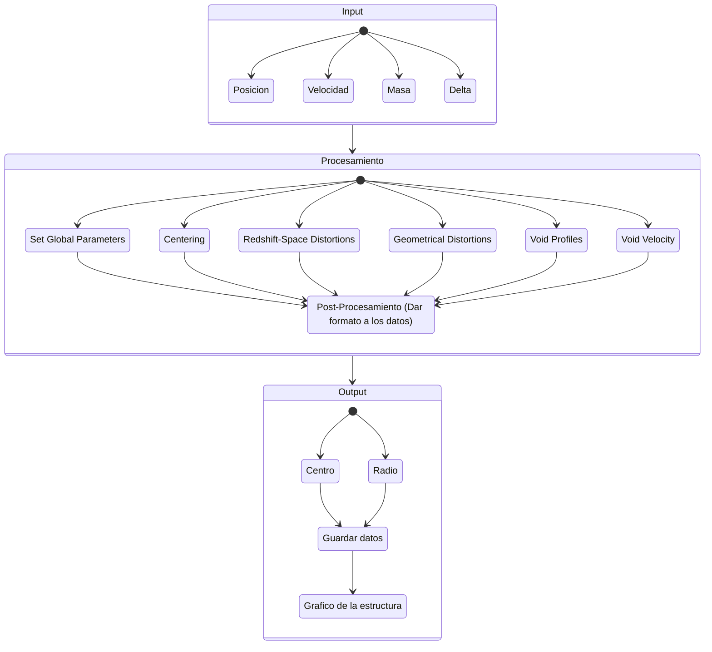
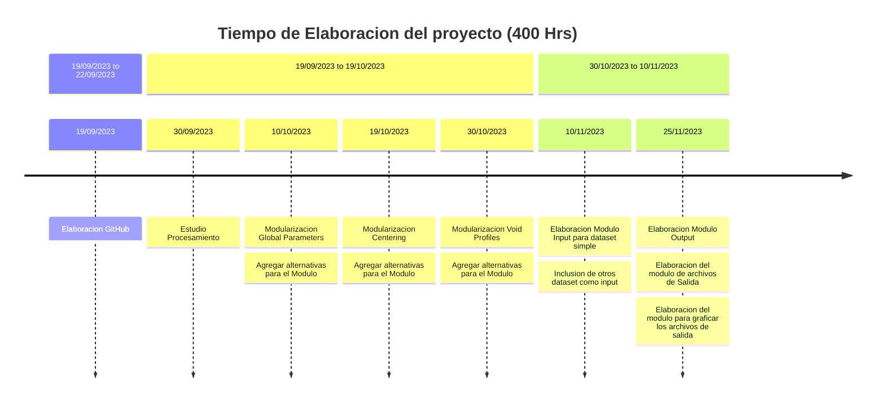

# VoidFinder Toolkit
The Void Finder Toolkit (VFT is a Python software package that integrates various publicly available algo-
rithms to characterize voids and represent them in a standardized and comparable manner, irrespective
of their geometry. The implementation includes a common interface inspired by the popular Scikit-Learn
architecture [Buitinck et al., 2013] that enables users, using the same set of tracers, to determine whether a
tracer belongs to a void as defined by a selected algorithm, facilitating a more direct comparison of results.

## Description
The code integrates three cosmic void detection algorithms, implemented in C/C++ to harness low-level
execution speed, with a common interface written in Python that offers users expressiveness and flexibil-
ity for interactive analysis.

### Finders

The current status of VFT integrates 3 public algorithms:
• Zobov [Neyrinck, 2008]: ZOBOV works in analogy with a watershed method with water filling basins
in a density field. It looks for voids as density minima with surrounding depressions and requires no
free parameters. Each Void grows in density starting from a local minimum up to a link density where
particles start falling into a deeper minimum.
• Spherical [Ruiz et al., 2015]: This method searches regions of low density in a Voronoi tessellation.
For each minimum density region the algorithm then grows a sphere around each candidate until the
average density inside reaches a specific threshold.
• Popcorn [Paz et al., 2023]: The algorithm targets low-density regions by adding layers on spherical void
shapes. Each layer strategically places seeds that expand while maintaining density. Only the best seed
merges, and a refined process ensures full coverage. This continues until small spheres can’t be added,
capturing the entire void effectively.

**INPUT**

En principio como input se utiliza un dataset sintetico con las siguientes caracteristicas:

- Posicion (En 3D)
- Velocidad (En 3D)
- Masa # No es indispensable
- Densidad Maxima de los Voids

De momento se plantea utilizar como input datasets correspondientes a catalogos sinteticos de galaxias dado que los mismos cuentan con las caracteristicas anteriores y no asi los catalogos observacionales. 

Concretamente cada punto en el dataset se corresponde con una galaxia.

Es posible que se agregue una seccion de preprocesamiento para el input dependiendo del catalogo sintetetico a utilizar.

**PROCESAMIENTO**

Para el procesamiento se utiliza como base un algoritmo escrito en C/C++ y que hay que refactorizar. Internamente el mismo consta de 6 partes (Ver diagrama de componentes), las cuales hay que modulariazar en primera instancia. Elementos como **Redshift-Space Distortions** y **Geometrical Distortions** son pertinentes a catalogos observacionales con los que no se trabajara aqui, sin embargo se mantendran dichos modulos para futuras aplicaciones. El modulo de **Void Velocity** es secundario.

Se buscara agregar alternativas a los otros modulos para darle flexibilidad al algoritmo segun los requerimientos del usuario.

**OUTPUT**

El output principalmente consiste de dos elementos que son cruciales para caracterizar a un *Void* como estructura, el **centro** del *void* y el **radio** del mismo.

Se utilizaran criterios distintos para definir estos parametros de salida en la seccion de **PROCESAMIENTO** como por ejemplo el numero de trazadores existentes a un determinado radio.

Los datos de salidas se guardaran en archivos, con extensiones diversas y habra posibilidad de graficar la salida en 3D.

## Diagrama de componentes

