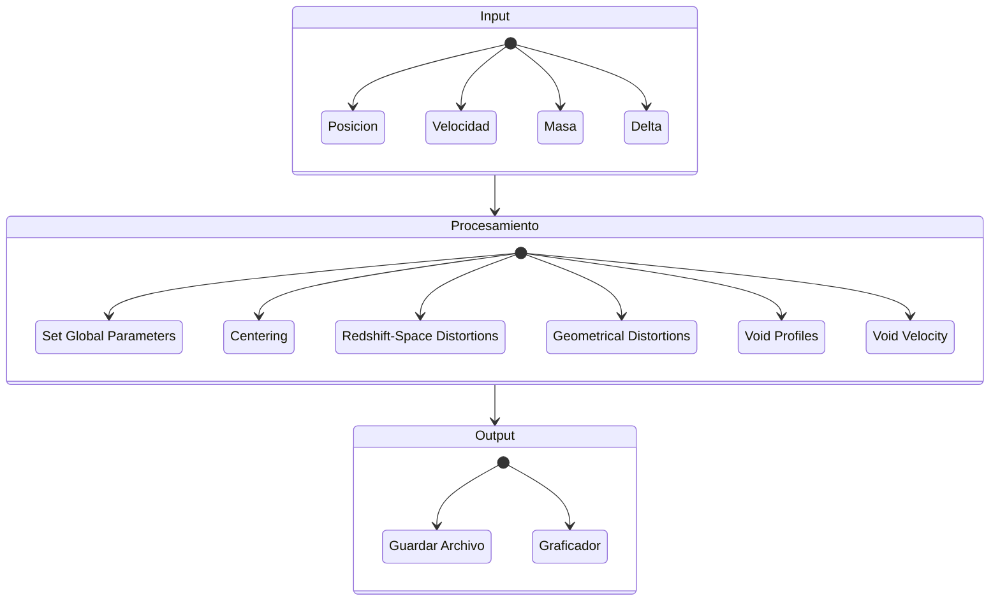

# voidFinderProject
Repositorio para el proyecto de Void Finder de la materia de Desarrollo de Software para computo Cientifico

## Descripcion
El presente trabajo consiste en un algoritmo que tiene como proposito tomar puntos de catalogos sinteticos de galaxias para encontrar regiones de baja densidad (Cosmic Voids).

Para ello se plantea implementar una pipeline de tres pasos , modulariazada y flexible que consite en un **input**, area de **procesamiento** y **output**.

1. 
Input

El input es un conjunto de puntos (Trazadores) con las siguientes caracteristicas

- Posicion (En 3D)
- Velocidad (En 3D)
- Masa # No es indispensable
- Densidad Maxima de los Voids

2. 
Procesamiento

3. 
Output

## Diagrama de componentes

